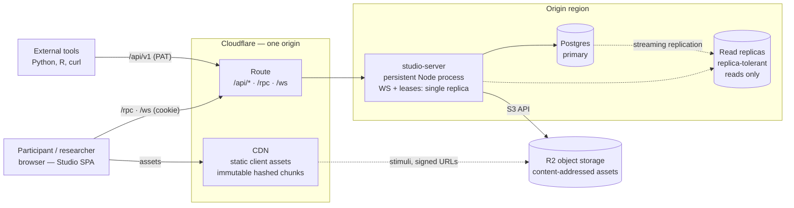
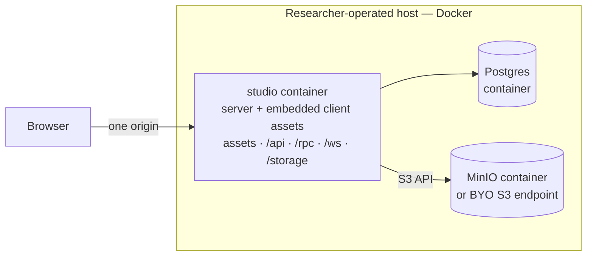

# Network Canvas Studio

Cloud-based, multi-tenant platform for designing network interview protocols
and collecting network data remotely. Specified by the issue tree rooted at
[#1242](https://github.com/complexdatacollective/network-canvas-monorepo/issues/1242);
the architecture follows the ADR recommendations and recorded decisions on
[#1245](https://github.com/complexdatacollective/network-canvas-monorepo/issues/1245)
(framework and deployment topology),
[#1246](https://github.com/complexdatacollective/network-canvas-monorepo/issues/1246)
(datastore), [#1247](https://github.com/complexdatacollective/network-canvas-monorepo/issues/1247)
(sync), and [#1248](https://github.com/complexdatacollective/network-canvas-monorepo/issues/1248)
(API surfaces).

## Layout

Studio is two independently deployable halves plus one shared leaf — the
package diamond decided 2026-08-11 on
[#1244](https://github.com/complexdatacollective/network-canvas-monorepo/issues/1244).
There is deliberately **no client↔server dependency edge**: the halves share
only the boundary package, so changesets and release CI re-gate a half only
when its boundary moved.

- `client/` — `@codaco/studio-client`: Vite + React SPA (TanStack Router,
  TanStack Query, `@codaco/fresco-ui`). Builds to static assets; talks to the
  server through typed oRPC procedures, importing the boundary contract
  type-only.
- `server/` — `@codaco/studio-server`: Hono app on `@hono/node-server`
  (Node 24 baseline), one persistent process serving every surface below,
  plus static client assets in the self-host topology.
- `packages/studio-rpc` — `@codaco/studio-rpc`: the internal RPC boundary
  (Zod schemas + typed oRPC contract). The only shared code between the
  halves.

## Surfaces

Three surfaces, one domain layer beneath them, none generated from another
(per the 2026-08-11 decision on #1248):

| Path       | Surface                  | Consumers                              | Stability                                             |
| ---------- | ------------------------ | -------------------------------------- | ----------------------------------------------------- |
| `/rpc`     | Internal RPC (oRPC v2)   | The SPA only                           | Unpublished, free-moving                              |
| `/api/v1`  | Public data API (REST)   | Researchers, external tools            | OpenAPI 3.1 (`/api/v1/openapi.json`), RFC 9457 errors |
| `/ws`      | Sync protocol            | The SPA's editor                       | Unpublished, protocol-versioned (#1247)               |
| `/storage` | Asset bytes (plain HTTP) | The SPA (upload), interviews (stimuli) | Unpublished; content-addressed, immutable (#1278)     |

Asset bytes live in S3-compatible object storage (#1246): Cloudflare R2 in
the managed topology, MinIO (or any S3-compatible endpoint) self-hosted.
Objects are keyed by content hash, so `/storage/:hash` responses are
immutable-cacheable by construction. Files ride plain HTTP rather than the
RPC surface — uploads must stream, retrievals must cache.

Uploaded bytes are untrusted and `/storage` is the app's own origin, so
retrieval never reflects the uploaded `Content-Type` blindly: only media a
browser cannot turn into script (the common image, audio, and video types) is
served inline with its own type, and everything else — HTML, SVG, anything
unrecognised — is served as `application/octet-stream` with
`Content-Disposition: attachment`, `X-Content-Type-Options: nosniff`, and a
`default-src 'none'; sandbox` CSP. Rendering SVG stimuli inline needs an
isolated asset origin first.

## Development

```bash
pnpm --filter @codaco/studio-server dev
pnpm --filter @codaco/studio-client dev
```

Two processes, one origin: the Vite dev server (port 5173) serves the SPA and
proxies `/api`, `/rpc`, `/storage`, `/healthz`, and `/ws` to the server
(port 3000) — playing the role the CDN plays in the managed topology, so the
browser sees a single origin in every topology. The server restarts on server
and `studio-rpc` source changes; the client has HMR.

The server's dev script also provisions **MinIO in Docker** (branch-scoped
container and volume, port 9100, bucket auto-created — mirroring Fresco's
`dev-s3` script), so asset storage works locally without any third-party
service. Docker must be running. The server's asset integration tests run
against this MinIO and skip when no object store is reachable.

The dev script likewise provisions **Postgres in Docker** (`dev-pg` — port
54318, `studio_dev` database auto-created). The port and credentials match
what `packages/studio-sync`'s conformance suite expects, so the one container
serves both; an externally managed Postgres already answering on the port is
used as-is. The server's database integration tests skip when no Postgres is
reachable. In production the connection comes from `DATABASE_URL`; when it is
unset the server still boots and database-backed surfaces refuse, mirroring
the S3 degradation contract.

### Signing in during development

Authentication (better-auth behind the `src/auth` seam, per #1245/#1255) is
active by default in development: the auth schema is applied to the dev
Postgres at boot, and magic-link email is delivered to the **server console**
— submit the sign-in form, copy the printed link into the browser. To
exercise real email instead, run [Mailpit](https://mailpit.axllent.org)
(`docker run -d -p 8025:8025 -p 1025:1025 axllent/mailpit`) and start the
server with `SMTP_URL=smtp://localhost:1025`; sent mail appears at
`http://localhost:8025`.

The server's `dev` and `start` scripts load a gitignored
`apps/studio/server/.env` if one exists (Node's native `--env-file-if-exists`),
so SMTP credentials and other local overrides can live there instead of the
shell environment.

Auth configuration follows the same all-or-nothing, fail-fast shape as S3:

| Variable             | Development default     | Real deployment                                                                                                            |
| -------------------- | ----------------------- | -------------------------------------------------------------------------------------------------------------------------- |
| `DATABASE_URL`       | the `dev-pg` Postgres   | unset in production ⇒ auth disabled, `/api/auth/*` refuses                                                                 |
| `BETTER_AUTH_SECRET` | fixed dev constant      | required — the dev constant never activates                                                                                |
| `PUBLIC_URL`         | `http://localhost:5173` | required (the browser-facing origin)                                                                                       |
| `SMTP_URL`           | unset ⇒ console mailer  | unset ⇒ magic-link sends refuse, never console-logged                                                                      |
| `EMAIL_FROM`         | `studio-dev@localhost`  | required alongside `SMTP_URL`                                                                                              |
| `TRUSTED_PROXIES`    | unset                   | proxy IPs/CIDRs (comma-separated); required behind a proxy for per-client rate limiting, else all clients share one bucket |

"Real deployment" means production `NODE_ENV` **or** an explicitly set
`DATABASE_URL`: the dev conveniences (publicly-known secret, localhost
origin, console mailer) are keyed to the dev-default database, so a deploy
that forgot `NODE_ENV=production` still refuses to run insecurely.

## Production

```bash
pnpm --filter @codaco/studio-client build   # client/dist — static assets
pnpm --filter @codaco/studio-server build   # server/dist — Node bundle
pnpm --filter @codaco/studio-server start   # serves both locally
```

The Docker image — the self-host artifact — builds from the monorepo root and
contains the server bundle plus the built client assets:

```bash
docker build -f apps/studio/Dockerfile -t network-canvas-studio .
docker run --rm -p 3000:3000 network-canvas-studio
```

## Deployment topologies

Decided 2026-08-11 on #1245. Both topologies run the same artifacts and
present a single origin; they differ only in who serves the static client
assets.

### Managed service

Cloudflare fronts the single hostname: it serves the client's hashed assets
from the CDN (retaining old hashes across deploys, so open tabs never lose
their chunks) and routes the server's paths to the origin — a persistent Node
process colocated with the Postgres primary. Edge compute is a non-goal;
replicas serve only reads the query layer marks replica-tolerant (#1246).



### Self-host

The same server image embeds and serves the client assets itself: the app
container, Postgres, and an S3-compatible object store (MinIO by default, or
bring your own endpoint) — the same shape Fresco self-hosters already run.



The server reads its object store from `S3_ENDPOINT`, `S3_REGION`,
`S3_BUCKET`, `S3_ACCESS_KEY_ID`, and `S3_SECRET_ACCESS_KEY` — all five or
none (partial configuration fails fast). Unset means asset routes refuse
with 503; outside production, unset defaults to the dev MinIO.

### What deploys when

| Release contains                 | Deploys                      | Live-session impact              |
| -------------------------------- | ---------------------------- | -------------------------------- |
| Client only                      | CDN asset publish            | None                             |
| Server only (boundary untouched) | Backend                      | WS reconnect + resume            |
| Additive boundary change         | Server, then client          | WS reconnect + resume            |
| Breaking boundary change         | Coordinated: server → client | Forced by the compatibility gate |

Backend deploys drop live WebSocket sessions by design, so the server drains
on SIGTERM (close 1001, stop the listener, bounded timeout) and the sync
protocol's reconnect-and-resume path makes the interruption routine (#1247).
Managed backend deploys trigger on `@codaco/studio-server` version changes —
never on image rebuilds — so client-only releases cannot bounce the backend.
