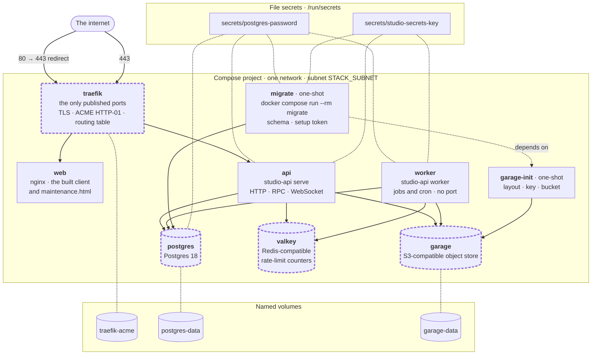
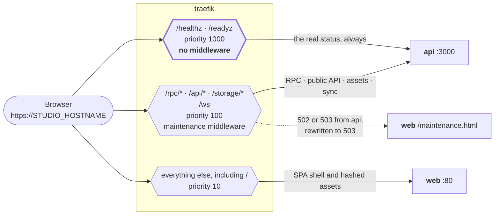

# Studio deployment topology

Two diagrams of one thing: `apps/studio/docker-compose.yml`, which is the whole
deployment and the same file in both topologies. The first is what runs; the
second is where a request goes. Mermaid in Markdown, so they render on GitHub
and on the documentation site without a build step.

To stand this up, see the [self-host guide](./self-host/README.md). What the
managed platform adds around it — the host, image publishing, the deploy
workflows and staging — is
[#1910](https://github.com/complexdatacollective/network-canvas-monorepo/issues/1910).

## The compose stack

Seven long-running containers and two one-shots on one network. Three of them —
the database, the object store and the rate-limit store — are swappable for an
institution's own service by setting one variable, and the ingress is swappable
by reproducing the routing table below in another proxy. See
[swap an element](./self-host/swap.md).

The four nodes with a dashed outline are the swappable elements. `traefik` is
the odd one out: the other three are swapped by pointing `DATABASE_URL`,
`S3_ENDPOINT` or `REDIS_URL` elsewhere in `.env`, while the ingress is a routing
table rather than an address, so swapping it means reproducing the table below.

`worker` publishes no port at all. Its readiness listener binds `127.0.0.1`
inside the container so the compose healthcheck has something to ask; nothing
routes to it.

## Request routing

One hostname serves the app, the API, the WebSocket and asset storage, so the
browser stays same-origin and cookies and WebSockets need no cross-origin
configuration. Traefik decides by path, highest priority first.

Four things this picture is drawn to make unmissable:

- **`/ws` is a `Path`, not a `PathPrefix`** — it is one endpoint. Traefik
  proxies the WebSocket upgrade with no further configuration.
- **`/healthz` and `/readyz` carry no middleware**, deliberately and at the
  highest priority. An upgrade script and the container runtime must read the
  real status and the named failing check; a maintenance page in front of these
  would report a healthy API that is not there.
- **The maintenance page comes from `web`**, which depends on nothing that an
  upgrade replaces. Traefik's `errors` middleware catches 502 and 503 from
  `api` and serves `/maintenance.html` in their place, rewriting both to 503:
  a stopped container is a connection error that Traefik reports as 502, "bad
  gateway" is not what is happening, and 503 is also what the API itself
  answers once maintenance mode exists
  ([#1901](https://github.com/complexdatacollective/network-canvas-monorepo/issues/1901)).
  A client and a monitor therefore see one status for the whole window however
  it started.
- **`/` goes to `web`.** The client is a single-page app and nginx serves its
  shell for every route that is not a file, so client-side routes deep-link.

An institution replacing Traefik reproduces exactly this table, and sets
`X-Forwarded-For` and `X-Forwarded-Proto` with `TRUSTED_PROXIES` naming the
proxy's address. The worked nginx example is in
[swap an element](./self-host/swap.md#the-ingress).
