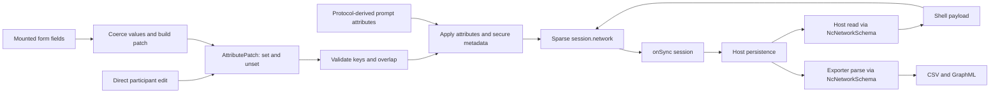

# `@codaco/interview`

The Network Canvas interview engine — packaged so any React host can embed
the survey UI a participant interacts with. Owns the Redux store, stage
navigation, all 20 interface implementations (NameGenerator, Sociogram,
CategoricalBin, Geospatial, …), the dialog system, the toast system, and
the design tokens. The host owns the network calls (sync, finish, asset
URL resolution) and where the participant currently is in the protocol.

The intended hosts are Fresco (Next.js) and the new Architect preview
mode (Vite) — but the package has no awareness of either.

---

## Install

```sh
pnpm add @codaco/interview
```

**Peer dependencies** (you most likely already have these):

```jsonc
{
  "@codaco/fresco-ui": "^2.5.4",
  "@codaco/protocol-validation": "^11.5.0",
  "@codaco/shared-consts": "5.0.0",
  "@codaco/tailwind-config": "^1.0.0-alpha.11",
  "immer": "^11.1.4",
  "motion": "^12.38.0",
  "react": "^19.2.5",
  "react-dom": "^19.2.5",
  "tailwindcss": "^4.2.4",
}
```

### Tailwind

The package assumes the host has a Tailwind v4 build plugin wired up
(`@tailwindcss/vite` for Vite, `@tailwindcss/postcss` for Next.js / any
PostCSS pipeline). Each CSS file in the chain owns one concern, and
consumers import them in order:

```css
/* styles/globals.css */
@import '@codaco/tailwind-config/fresco.css'; /* Tailwind v4 + theme + plugins + fonts */
@import '@codaco/fresco-ui/styles.css'; /* @source glue for fresco-ui's classes */
@import '@codaco/interview/styles.css'; /* @source glue for interview's classes */
```

**Do not also `@import "tailwindcss"` yourself.** That import lives
inside `@codaco/tailwind-config/fresco.css`; adding it again loads
Tailwind's runtime twice and produces duplicate / conflicting
utilities.

Each of `@codaco/fresco-ui/styles.css` and `@codaco/interview/styles.css`
is a tiny file containing only a `@source "./**/*.{js,ts,tsx}"`
directive scoped to that package's own module files. The glob resolves
relative to wherever the imported `styles.css` sits — the package's
`src/` tree when consumed from source (as workspace hosts do), or the
mirrored `dist/` copy for an npm install. With both imported, Tailwind's
class scanner walks both packages and emits every utility class the
components reference. Hosts no longer need to write
`@source '../node_modules/...'` lines themselves.

`@codaco/tailwind-config/fresco.css` bundles both the default and
interview theme variants. Shell renders `<main data-theme-interview>`
with a portal container so dialogs/popovers stay inside the themed
subtree — no host-side setup required. See _Theming & DOM scope_ below.

### Vitest / jsdom

Node has no CSS loader, so any vitest test that imports from
`@codaco/interview` (even just the schemas) needs Vite to process
the package, otherwise you get
_"TypeError: Unknown file extension `.css`"_. Inline the package on
every project that uses jsdom:

```ts
// vitest.config.ts
export default defineConfig({
  test: {
    server: {
      deps: { inline: ['@codaco/interview'] },
    },
  },
});
```

---

## The Shell component

```tsx
import {
  createDebouncedSyncHandler,
  Shell,
  type InterviewPayload,
} from '@codaco/interview';
```

A complete minimal host (TypeScript / Next.js App Router style — the
shape is identical for any other React framework):

```tsx
'use client';

import {
  createDebouncedSyncHandler,
  Shell,
  type AssetRequestHandler,
  type FinishHandler,
  type InterviewPayload,
  type ProtocolLocaleChangeHandler,
  type SyncHandler,
} from '@codaco/interview';
import { useCallback, useMemo, useState } from 'react';
import { useRouter, useSearchParams } from 'next/navigation';

export default function InterviewClient({
  payload,
  requestedLocales,
  resolveAssetUrl,
}: {
  payload: InterviewPayload;
  // The participant's browser languages, most preferred first.
  // `navigator.languages` in a client-only host; the parsed Accept-Language
  // header, passed down from the server, in a server-rendered one.
  requestedLocales: readonly string[];
  resolveAssetUrl: (assetId: string) => Promise<string>;
}) {
  const router = useRouter();
  const params = useSearchParams();

  // currentStep is HOST state — the package never owns it. Keep it in
  // useState, nuqs, a context, the URL, wherever fits the host. The
  // package re-renders when the prop changes.
  const [currentStep, setCurrentStep] = useState<number>(() =>
    Number(params.get('step') ?? 0),
  );

  const onStepChange = useCallback(
    (step: number) => {
      setCurrentStep(step);
      const next = new URLSearchParams(params.toString());
      next.set('step', String(step));
      router.replace(`?${next.toString()}`);
    },
    [params, router],
  );

  // Persist state on every reducer commit. Receives a `SessionSnapshot` —
  // POST it to your server, write to IndexedDB, anything. Do not store its
  // `locale` or `localePreference` from here; `onProtocolLocaleChange` below
  // owns those two fields.
  //
  // The engine offers every change as it happens and never batches on your
  // behalf: only you know what one write costs. A local write can take them
  // all; a network request usually should not, so wrap it in
  // `createDebouncedSyncHandler` (below) rather than posting per answer.
  const onSync: SyncHandler = useMemo(
    () =>
      createDebouncedSyncHandler(
        async (interviewId, session) => {
          await fetch(`/interview/${interviewId}/sync`, {
            method: 'POST',
            body: JSON.stringify(session),
          });
        },
        { waitMs: 3000 },
      ),
    [],
  );

  // Persists the interview language. Called when the participant picks a
  // language on a LanguageChooser stage, and whenever the language shown
  // differs from the stored `locale`. Write only these two fields, in their
  // own request, so a later `onSync` write cannot overwrite them.
  const onProtocolLocaleChange: ProtocolLocaleChangeHandler = useCallback(
    async (interviewId, { locale, localePreference }) => {
      await fetch(`/interview/${interviewId}/locale`, {
        method: 'POST',
        body: JSON.stringify({ locale, localePreference }),
      });
    },
    [],
  );

  // Called when the participant clicks Finish on the FinishSession
  // stage. Receives an AbortSignal so you can cancel any in-flight work
  // if the user backs out.
  const onFinish: FinishHandler = useCallback(
    async (interviewId, signal) => {
      await fetch(`/interview/${interviewId}/finish`, {
        method: 'POST',
        signal,
      });
      router.push(`/interview/${interviewId}/complete`);
    },
    [router],
  );

  // Stages reference protocol assets by ID. The package calls this
  // exactly when a stage needs a URL — return a same-origin URL,
  // pre-signed S3 URL, blob: URL, whatever your storage uses.
  const onRequestAsset: AssetRequestHandler = useCallback(
    (assetId) => resolveAssetUrl(assetId),
    [resolveAssetUrl],
  );

  return (
    <Shell
      requestedLocales={requestedLocales}
      payload={payload}
      currentStep={currentStep}
      onStepChange={onStepChange}
      onSync={onSync}
      onProtocolLocaleChange={onProtocolLocaleChange}
      onFinish={onFinish}
      onRequestAsset={onRequestAsset}
    />
  );
}
```

### Why is `currentStep` host state?

So the host can drive it however it likes — `nuqs` URL params, browser
history, a stepper UI, deep links from email, server-rendered initial
position. The package reads `currentStep` and emits `onStepChange` for
every navigation; it does not maintain its own copy.

This is also what allows the host to mount `Shell` once but render
different stages without re-creating the Redux store: only the
`currentStep` prop changes between renders.

### Shell props

| Prop                            | Type                                                                  | Required | Notes                                                                                                                                                                                                                                                                                                                                                                                                                                                                                                                               |
| ------------------------------- | --------------------------------------------------------------------- | -------- | ----------------------------------------------------------------------------------------------------------------------------------------------------------------------------------------------------------------------------------------------------------------------------------------------------------------------------------------------------------------------------------------------------------------------------------------------------------------------------------------------------------------------------------- |
| `requestedLocales`              | `readonly string[]`                                                   | yes      | The participant's browser languages, most preferred first: `navigator.languages` on the client, the parsed `Accept-Language` header on the server (`parseAcceptLanguage` from `@codaco/protocol-validation`). Until the participant states a preference, these choose both the protocol language and the interface language. See _Language_ below.                                                                                                                                                                                  |
| `payload`                       | `InterviewPayload`                                                    | yes      | `{ session, protocol }` — see the type for shape. The store is created once per `payload.session.id`; pass a stable reference.                                                                                                                                                                                                                                                                                                                                                                                                      |
| `currentStep`                   | `number`                                                              | yes      | The stage index the participant is on. Owned by the host.                                                                                                                                                                                                                                                                                                                                                                                                                                                                           |
| `onStepChange`                  | `(step: number) => void`                                              | yes      | Fired whenever the participant navigates. The host should mirror `step` into its own state.                                                                                                                                                                                                                                                                                                                                                                                                                                         |
| `onSync`                        | `(id, session, opts) => Promise`                                      | yes      | Called after every Redux commit — the engine does not batch. `session` is a `SessionSnapshot`. Persist however you like; wrap in `createDebouncedSyncHandler` if writes are expensive. `opts.immediate` marks writes that must not be deferred (exit, finish); `opts.unloading` additionally marks the ones the document may not survive (hidden, pagehide). A change to `locale` or `localePreference` alone never triggers it, and a host persisting the snapshot must not write those two fields (see `onProtocolLocaleChange`). |
| `onProtocolLocaleChange`        | `(id, { locale, localePreference }) => Promise`                       | yes      | Persists the session's two language fields, which `onSync` never writes. Called when the participant states a preference, and whenever the language shown differs from the stored `locale`. Calls for one interview run one at a time, in order. A rejected call is logged and the next one still runs.                                                                                                                                                                                                                             |
| `onFinish`                      | `(id, AbortSignal) => Promise`                                        | yes      | Called from the FinishSession stage. The signal aborts if the user navigates away mid-flight.                                                                                                                                                                                                                                                                                                                                                                                                                                       |
| `onRequestAsset`                | `(assetId) => Promise<url>`                                           | yes      | Resolve a protocol asset to a URL. Called lazily as stages mount.                                                                                                                                                                                                                                                                                                                                                                                                                                                                   |
| `analytics`                     | `InterviewAnalyticsMetadata`                                          | yes      | Host metadata attached as super-properties on every event: `installationId` (anonymous host UUID), `hostApp` (e.g. `"Fresco"`), `hostVersion?`.                                                                                                                                                                                                                                                                                                                                                                                     |
| `posthogClient`                 | A posthog-js client (needs `capture`, `captureException`, `register`) | no       | Pre-initialised PostHog client. When provided, the package emits events through it without modifying its config. When absent, the package lazy-initialises its own named instance against `ph-relay.networkcanvas.com`.                                                                                                                                                                                                                                                                                                             |
| `disableAnalytics`              | `boolean`                                                             | no       | When `true`, all event emission is suppressed (no `posthog-js` import). Default `false`. Use for E2E and synthetic-interview runs.                                                                                                                                                                                                                                                                                                                                                                                                  |
| `finishConfirmationDescription` | `ReactNode`                                                           | no       | Host-specific explanation shown in the finish confirmation dialog. Defaults to localized neutral guidance that does not promise responses are immutable. A subscribed message component can keep a host override responsive to language changes.                                                                                                                                                                                                                                                                                    |
| `flags`                         | `{ isE2E?, isDevelopment? }`                                          | no       | `isE2E: true` exposes `window.__interviewStore` for Playwright fixtures. `isDevelopment: true` enables redux-logger.                                                                                                                                                                                                                                                                                                                                                                                                                |

The package replaces a previous `onError` callback with internal `posthog.captureException` calls; render errors and asset-load failures are reported via the resolved analytics client (or suppressed when `disableAnalytics` is `true`). The host does not need to wire its own error sink.

#### Language

An interview shows two languages, each chosen on its own:

- **The protocol language** is the translation of the protocol's own text
  (titles, prompts, labels, options). The protocol declares its languages and a
  `defaultLocale`.
- **The interface language** is the package's own text (buttons, menus,
  validation, accessibility labels, help), chosen from the package's built-in
  languages.

Both start from the same two inputs:

- `requestedLocales`, the browser's languages in preference order. Pass
  `navigator.languages` on the client, or the parsed `Accept-Language` header on
  the server (`parseAcceptLanguage` from `@codaco/protocol-validation`),
  serialised to the client so both render alike.
- The session's `localePreference`, the language the participant picked on a
  `LanguageChooser` stage. It is `null` until they pick one.

How each language is chosen:

- **Protocol language.** With no `localePreference`, the first of
  `requestedLocales` that the protocol declares, otherwise its `defaultLocale`.
  With a `localePreference`, the preference alone is matched when choosing the
  language shown, so a preference the protocol no longer declares gives the
  `defaultLocale`.
- **Interface language.** `[localePreference, ...requestedLocales]` is matched
  in order against the built-in languages, and the first fit wins; otherwise
  `en`. A `localePreference` of `und` is skipped.

Requests match by best fit, one at a time, so `es-MX` matches a declared `es`,
`pt-PT` a declared `pt-BR`, and `zh-TW` a declared `zh-Hant`. The matching uses
CLDR's language data, so it also treats a few languages as acceptable
substitutes for one another, such as Swiss German for German. Until a
preference is stated, both languages are chosen afresh on every load, so a
resumed interview on a device with other languages can show a different one.

The language shown is not the only one a participant can see. For each piece of
protocol text, the package shows the best available translation: first the
language shown (or the closest related language the text has), then each other
language in `requestedLocales` in turn, then the protocol's `defaultLocale`,
then any language that has the text. So a text missing from the language shown
appears in another language the participant's browser lists, if the protocol has
it there, before it falls back to the default. The protocol's own order of
`locales` plays no part in any of this: languages have no order.

The `LanguageChooser` stage is the only control a participant has over the
language; the settings menu has none. Choosing a language applies at once, to
protocol text and the interface alike, and sets `localePreference`. Leaving the
preselected language alone states no preference. The package stores nothing
itself and reads no browser or storage globals: `requestedLocales` is the only
input it takes from the environment.

The interface currently supports `en`, `en-GB`, `es`, `zh-Hans`, `zh-Hant`,
`de`, `nl`, `pt-BR`, `it`, and `fr`. Regional requests match to them, such as
`es-MX` to `es`, `zh-CN` and `zh-SG` to `zh-Hans`, `zh-TW`, `zh-HK` and `zh-MO`
to `zh-Hant`, `de-AT` to `de`, `nl-BE` to `nl`, `pt` or `pt-PT` to `pt-BR`,
`it-CH` to `it`, and `fr-CA` to `fr`. Unsupported or malformed requests fall
back to `en`. All interface messages are bundled, so switching language needs no
network. Research values and identifiers are always passed through unchanged.

Changing `requestedLocales` takes effect immediately and preserves the mounted
interview, pending form input, navigation and answers. The package sets `lang`
(the interface language) and `dir` on its own region, lays the stage out in the
direction of the protocol language shown, and leaves the host document's
language to the host.

##### Session language fields

Three fields on the session payload carry the language:

| Field              | Persisted | Purpose                                                                                                                                                          |
| ------------------ | --------- | ---------------------------------------------------------------------------------------------------------------------------------------------------------------- |
| `localePreference` | yes       | The participant's stated choice, or `null`. The only stored value that decides the language shown.                                                               |
| `locale`           | yes       | The protocol language last shown. Used for export only (the exported interview language); it never chooses a language. `null` until the engine first reports it. |
| `localeOptions`    | no        | Presentation metadata (`{ locale, label, direction }`) for each language the protocol declares, in any order. Present on `SessionPayload` only; never persisted. |

Persist the first two through `onProtocolLocaleChange`, not `onSync`.
`SessionSnapshot`, the type `onSync` receives, still includes both fields, but
changing them alone never calls `onSync`, and a host writing a snapshot must
leave them alone. That keeps a late general write from overwriting a language
the participant just chose.

Derive `localeOptions` with `getLocaleMetadata` from
`@codaco/protocol-validation`, one entry for each of
`protocol.localization.locales`, in any order; the package sorts them
alphabetically by label for the interface language, so the chooser lists the
same order whatever the host passes. `Shell` throws only if the set of
languages differs from the declaration. The host derives them rather than the
package so a server-rendered host serialises the exact labels it rendered:
display names vary between JavaScript runtimes, and deriving them again on the
client would break hydration. A protocol that records no language (one made in
Studio, for example) uses the tag `und`, which the chooser shows as an
unspecified language. A protocol migrated from schema 8 declares English
(`en`).

##### Outside `Shell`

Hosts rendering exported controls outside `Shell`, such as an inline
`ProtocolField` preview, need the two providers `Shell` mounts for itself:

- `InterviewI18nProvider` supplies the interface language. It takes
  `requestedLocale` (a string, an ordered array, or `null`) and an optional
  `localePreference`, and resolves them as above.
- `ProtocolLocalizationProvider` supplies the protocol language. It takes
  `localization` (the protocol's declaration), `localeOptions`,
  `requestedLocales`, `localePreference`, `recordedLocale`,
  `onLocalePreferenceChange` and `onLocaleRecorded`. Controls that render
  protocol-authored text throw outside it.

Hosts that already own an i18n provider can instead merge `interviewCatalogs`
from `@codaco/interview/locales` into their app catalog. Without
`InterviewI18nProvider`, standalone controls use their English defaults.

#### Analytics

The interview package emits PostHog events directly — there is no `onError`-style host bridge. Three operating modes:

1. **Host-supplied client** — pass `posthogClient`; the package emits via the host's instance, with `distinct_id` overridden per event to the interview id. Host instance config (autocapture, identify, session recording) is the host's responsibility.
2. **Own instance** — omit `posthogClient`; the package lazy-imports the `posthog-js/dist/module.no-external` build (no remote script loader, so it runs under a `script-src 'self'` policy) and inits a named instance (`'@codaco/interview'`) against `https://ph-relay.networkcanvas.com`.
3. **Disabled** — pass `disableAnalytics={true}`; no events emitted, no posthog-js import.

PII contract: events never include protocol-network data, protocol-author content (stage labels, prompt text, codebook labels, asset names), or participant input (form values, free-text, alter labels, search queries, passphrases). Events include only structural identifiers (stage type/index, prompt index, random node/edge UUIDs), codebook **internal ids** (e.g. `"person"`, `"friend"`), counts, durations, and package-defined discriminators.

The full event taxonomy lives at [`docs/superpowers/specs/2026-05-05-interview-analytics-design.md`](../../docs/superpowers/specs/2026-05-05-interview-analytics-design.md).

### Toast viewport

`Shell` mounts its own Base UI toast provider and viewport inside the themed,
localized interview region. Hosts do not need another interview viewport.
This keeps notification text and accessible names in the interview's interface
language, including when the host uses a different language.

Each Shell keeps its validation notifications independent from other mounted
interviews. An app-level toast provider can remain separate for host-owned
notifications outside the interview.

---

## Building an `InterviewPayload` server-side

The package never reaches into the host's database. Your server hands
over a fully resolved `{ session, protocol }` object, with all
`asset://` URLs already mapped to the IDs `onRequestAsset` will be
called with.

```ts
import {
  type InterviewPayload,
  type ProtocolPayload,
  isValidAssetType,
} from '@codaco/interview';
import { getLocaleMetadata, hashProtocol } from '@codaco/protocol-validation';

export async function loadInterviewPayload(
  interviewId: string,
): Promise<InterviewPayload> {
  const interview = await db.interview.findUniqueOrThrow({
    where: { id: interviewId },
    include: { protocol: true },
  });

  // protocol assets come from your DB / object store — flatten to the
  // shape the package consumes
  const assets = interview.protocol.assets
    .filter((a) => isValidAssetType(a.type))
    .map((a) => ({
      assetId: a.id,
      name: a.name,
      type: a.type,
      ...(a.value ? { value: a.value } : {}), // apikey assets only
    }));

  const protocol: ProtocolPayload = {
    ...interview.protocol,
    // Content hash of { codebook, stages }. Computed at protocol-import time
    // by `hashProtocol` from @codaco/protocol-validation; forwarded here as a
    // super-property on every analytics event.
    hash: interview.protocol.hash ?? hashProtocol(interview.protocol),
    importedAt: interview.protocol.importedAt.toISOString(),
    assets,
  };

  return {
    session: {
      id: interview.id,
      // … the rest of SessionPayload — see the type for the full shape
      network: interview.network ?? createInitialNetwork(),
      stageMetadata: interview.stageMetadata,
      // Stored language fields (null on a new interview). Written back only
      // through `onProtocolLocaleChange`.
      localePreference: interview.localePreference,
      locale: interview.locale,
      // Not stored: derived on each load, one entry per declared language, in
      // any order (the interview sorts them).
      localeOptions: protocol.localization.locales.map((locale) =>
        getLocaleMetadata(locale),
      ),
      // …
    },
    protocol,
  };
}
```

`createInitialNetwork()` returns the canonical empty network with an ego
node already initialised — call it once when you create a new interview
record so subsequent loads pass schema validation.

---

## Sparse entity attribute flow

Interview stores entity attributes as sparse records. An own attribute key
always has a defined `VariableValue`; a missing key means the variable is
unset. `false`, `0`, `''`, and `[]` are defined responses and remain present.



The internal `AttributePatch` contract separates setting defined values from
removing properties:

```ts
type AttributePatch = Readonly<{
  set: Readonly<Record<string, VariableValue>>;
  unset: readonly string[];
}>;
```

Form submission first coerces values to their protocol variable types. The
adapter then considers exactly the mounted field names: each defined value goes
to `set`, each `undefined` value goes to `unset`, and unmounted fields are
ignored. If any mounted defined value is not a `VariableValue`, conversion
fails as a whole and no partial patch is dispatched.

Creation and editing deliberately use different parts of that result:

- Creating an entity writes only `set`, so unanswered fields are omitted.
- Editing applies both `set` and `unset`, so clearing a mounted field deletes
  that key while attributes outside the form remain unchanged.
- Direct participant edits, such as bins and layout controls, produce the same
  patch shape instead of writing nullish sentinels.

The node, edge, and ego update thunks validate that participant-edit patch keys
belong to the applicable codebook definition and reject a key that appears in
both `set` and `unset`. Node and edge creation apply the same key check to their
initial attributes; controlled roster and pedigree imports can explicitly
allow external node attributes. Validation completes before the fulfilled
reducer can mutate session state. Prompt-membership patches are derived directly
from the protocol's `additionalAttributes`, so reducers apply those trusted
keys without repeating patch validation.

The shared applicator produces new attribute and secure-metadata maps for both
validated and protocol-derived patches. An `unset` removes the attribute and
its matching `_secureAttributes` entry in the same reducer transition; an empty
secure-metadata map collapses to `undefined`.

Network Composer undo history is presence-sensitive. For every touched key, an
inverse patch restores a prior own value with `set`, but restores prior absence
with `unset`. This distinction is required when a defined empty value such as
`[]` is edited and then undone.

`onSync` hands the host the sparse session after reducer commits. Hosts parse
stored or received networks with `NcNetworkSchema` before constructing the next
`Shell` payload; this accepts nullish input entries but emits sparse output.
`@codaco/network-exporters` repeats that parse per session before formatting,
so persistence and export do not reintroduce nullish attribute values.

---

## Public API reference

Everything below is exported from `'@codaco/interview'`. Additional public
subpaths expose the contract, protocol schema version, locale catalogs and
styles; host code should not reach into package internals.

### Components

- `Shell` — the runtime
- `InterviewI18nProvider` — interface-language boundary for exported controls
  used outside `Shell`
- `ProtocolLocalizationProvider` — protocol-language boundary for exported
  controls used outside `Shell`, such as `ProtocolField`

### Schemas + helpers

- `createInitialNetwork()` — empty network with ego seeded. Call once
  per new interview.
- `isValidAssetType(type)` — type predicate for `ResolvedAsset.type`.
- `getNodeLabelAttribute(variables, attributes)` — pick the variable
  whose value should be displayed as a node's label. Used by sibling
  packages (e.g. `@codaco/network-exporters`) so exports use the same
  labelling logic the UI does.

### Validating stored stage metadata

`StageMetadataSchema` (from `@codaco/shared-consts`) is the Zod schema for
`session.stageMetadata`. Use it to validate state restored from your
database before passing it back into a payload.

### Synthetic data

`generateNetwork` lives in `@codaco/protocol-utilities`, alongside
`SyntheticInterview`.

### Public types

```ts
type InterviewPayload = { session: SessionPayload; protocol: ProtocolPayload };

// The session as the engine holds it and hands it to `SyncHandler`.
type SessionSnapshot = {
  id: string;
  startTime: string;
  finishTime: string | null;
  exportTime: string | null;
  lastUpdated: string;
  network: NcNetwork;
  promptIndex?: number;
  stageMetadata?: StageMetadata;
  stageRequiresEncryption?: boolean;
  // The participant's stated language. Persisted; the only stored value that
  // decides which protocol translation is shown.
  localePreference: LocaleTag | null;
  // The protocol language last shown. Persisted for export only.
  locale: LocaleTag | null;
};

// What a host passes to start or resume an interview.
type SessionPayload = SessionSnapshot & {
  // One entry per declared protocol language, in any order; the interview
  // sorts them (`getLocaleMetadata` from @codaco/protocol-validation). Never
  // persisted.
  localeOptions: readonly LocaleMetadata[];
};

type ProtocolPayload = Omit<CurrentProtocol, 'assetManifest'> & {
  id: string;
  importedAt: string; // ISO
  assets: ResolvedAsset[];
};

type ResolvedAsset = {
  assetId: string;
  name: string;
  type: 'image' | 'video' | 'audio' | 'network' | 'geojson' | 'apikey';
  value?: string; // apikey only
};

type SyncOptions = {
  // Do not defer this write.
  immediate: boolean;
  // The document is being hidden or unloaded and may never run script again:
  // use a transport that outlives it, and do not queue behind a request that
  // will die with it. Always accompanied by `immediate`.
  unloading: boolean;
};
type SyncHandler = (
  interviewId: string,
  session: SessionSnapshot,
  options: SyncOptions,
) => Promise<void>;

type ProtocolLocaleChange = Readonly<{
  locale: LocaleTag;
  localePreference: LocaleTag | null;
}>;
// Persists `locale` and `localePreference`; SyncHandler never writes them.
// Calls for one interview are made one at a time, in order.
type ProtocolLocaleChangeHandler = (
  interviewId: string,
  change: ProtocolLocaleChange,
) => Promise<void>;

// Batching is the host's decision. This wraps a handler so ordinary changes
// are rate-limited to one write per `waitMs` carrying the newest state, while
// `immediate` writes go out at once.
function createDebouncedSyncHandler(
  write: SyncHandler,
  options: { waitMs: number },
): SyncHandler;
type FinishHandler = (
  interviewId: string,
  signal: AbortSignal,
) => Promise<void>;
type AssetRequestHandler = (assetId: string) => Promise<string>;
type ErrorHandler = (error: Error, ctx?: Record<string, unknown>) => void;
type StepChangeMeta = { progress: number; totalSteps: number };
type StepChangeHandler = (step: number, meta: StepChangeMeta) => void;

type InterviewerFlags = {
  isE2E?: boolean;
  isDevelopment?: boolean;
};
```

---

## Theming & DOM scope

`Shell` renders a single `<main data-theme-interview>` element. This is both the stable selector for tests / e2e fixtures and the wrapper that activates the interview theme: descendants pick up the dark palette, Nunito typography, and responsive root font-size automatically.

`Shell` also provides a portal container (via `<PortalContainerProvider>` from `@codaco/fresco-ui/PortalContainer`) so dialogs, popovers, dropdowns, tooltips, toasts, selects, and comboboxes opened from inside the interview render into a node _inside_ the themed subtree — they inherit the interview palette automatically rather than portaling to `document.body`.

If you render interview-themed UI **outside** of `Shell` (e.g. a "thank you" page after the interview ends), wrap that UI with `<ThemedRegion theme="interview">` from `@codaco/fresco-ui/ThemedRegion`:

```tsx
import { ThemedRegion } from '@codaco/fresco-ui/ThemedRegion';

<ThemedRegion theme="interview">
  <ThankYouPage />
</ThemedRegion>;
```

`<ThemedRegion>` and its ancestors up to `<body>` must not have `transform`, `filter`, `perspective`, or `contain` set — these create new containing blocks for fixed-positioned descendants and would break modal/popover positioning.

---

## Testing the integration

### Unit / component tests (Vitest + jsdom)

See the _Vitest / jsdom_ note above — inline `@codaco/interview` in
your config so the CSS side effect resolves cleanly.

### End-to-end (Playwright)

For e2e you usually want a deterministic stand-in for the host's data
layer. The package supports this through the `isE2E` flag, which
exposes the live Redux store as `window.__interviewStore` so fixtures
can read network state without hitting your database:

```ts
<Shell {...props} flags={{ isE2E: true }} />
```

The package's own e2e suite (in this repo) uses a Vite host that
implements `window.__test` hooks for `installProtocol` / `createInterview` /
`reset`, runs in the official `mcr.microsoft.com/playwright` image for
font-rendering determinism, and asserts against per-stage screenshots in
`e2e/visual-snapshots/{chromium,firefox,webkit}-matrix/`. Use it as a reference
for wiring your own e2e setup — see [`e2e/README.md`](./e2e/README.md) for the
layout and the test-authoring pattern.

For interactive debugging (no test runner), run **`pnpm dev:host`** to boot
the Vite host + asset server, prepare the silos protocol, and open a browser
tab that lands directly in step 0 of the interview — no console paste.

---

## What lives in this package, what doesn't

In:

- the Redux store + every reducer / selector / thunk
- all 20 stage interfaces and the navigation chrome
- the dialog system, toast system, and stage error boundary
- the synthetic network generator
- the contract types and the schemas the host serialises against

Out:

- everything that touches a database, a session cookie, or the network
- protocol parsing and validation (use `@codaco/protocol-validation`)
- export to GraphML / CSV (use `@codaco/network-exporters`)
- network filtering / query DSL (use `@codaco/network-query`)

When in doubt: if it would still make sense to ship it embedded inside a
non-Fresco host (Architect's preview mode, a CLI, an Electron app), it
belongs here. If it talks to Fresco's Postgres or its auth layer, it
doesn't.

---

## License

MIT — see the repository root.
